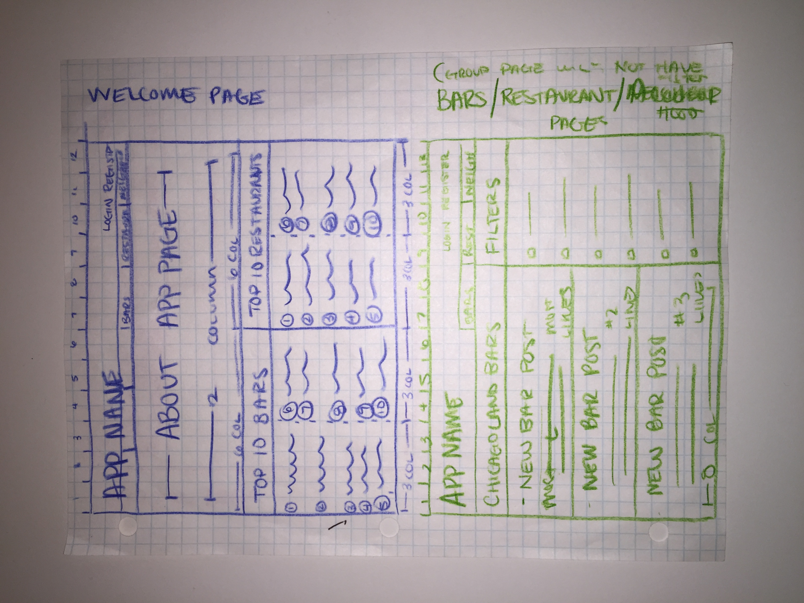
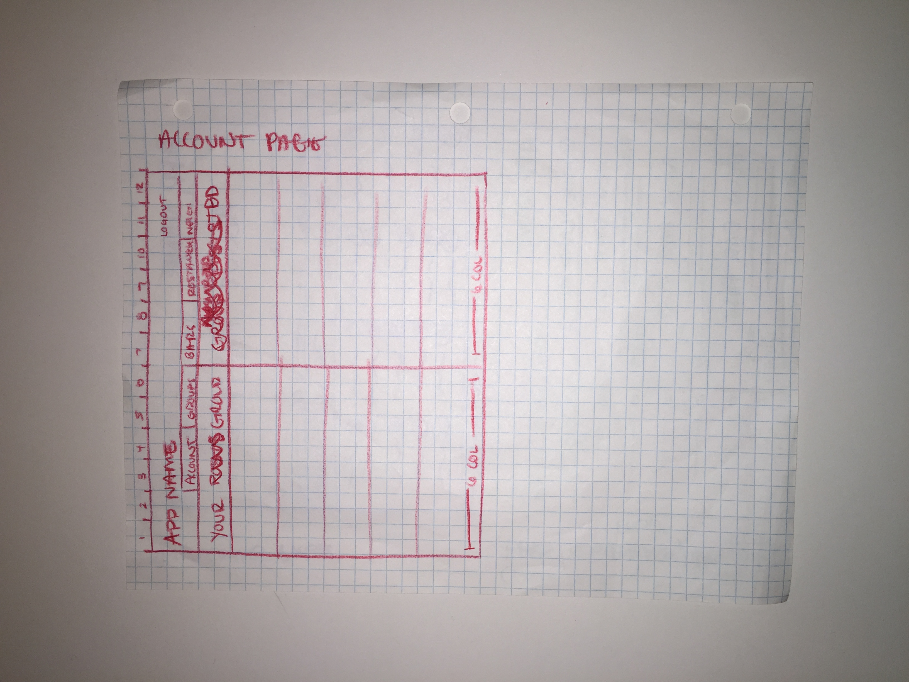
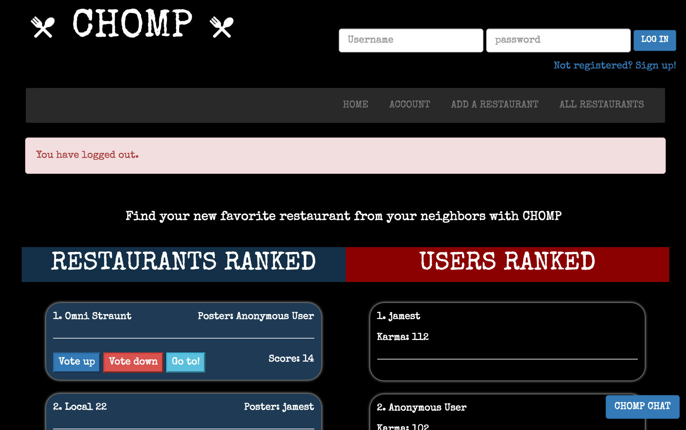
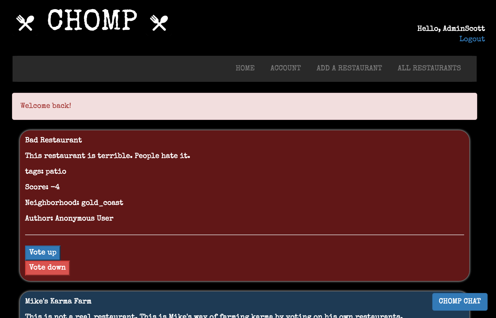
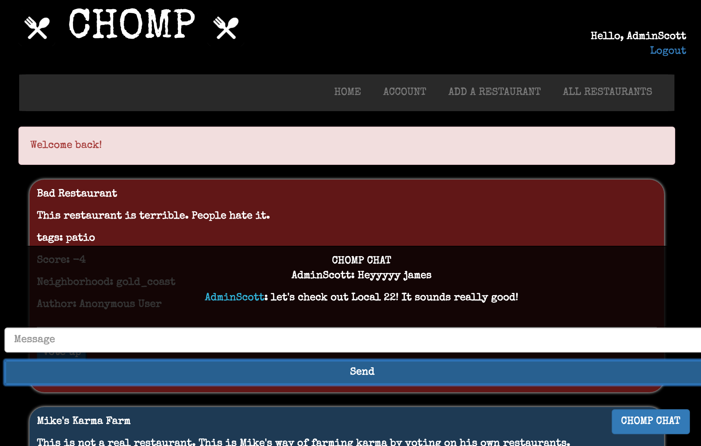

*************************************************

**PURPOSE:** Create an interactive forum for Chicago natives to post and chat about local restaurants. This is an answer to big corporate sites like yelp that may be bogged down by company influences and too much happening. Chomp is a good old fashioned local forum to vote on your favorite restaurants.

**INSTRUCTIONS:** Create an account with a username and password. Then feel free to check out other user's posts. Vote restaurants up or down based on whether you like them or not! This also credits the original poster with Karma points! Become more trustworthy as your neighborhood Karma increases!

Our restaurants page shows more detail on all the restaurants our neighborhood has been talking about!

Engage the rest of your neighbors on CHOMP CHAT to go into more details or offer further advice in our chat forum!

See what restaurants are getting all of the buzz on CHOMP!

*********************************************

**Technologies Used:**
- HTML
- CSS
- javascript
- jQuery
- Sinatra
- sqlite
- BCrypt
- Database work and Migrations
- Local storage
- Photoshop

**Approach Taken:**

For this project, Mike did a majority of the back end while Scott focused a lot on the front end.

We kept scope reasonable by wanting to ensure each option added was logical and necessary before embarking on a big undertaking. Scott shot WAYYY too far at first - from our wireframes, a lot shifted based on practicality and needs:

ORIGINAL WIREFRAMES

These were shortly change as we operated through. We prioritized our work in the below order:

- [x] User can post restaurant data
- [x] User can log in and out
- [x] Chat functionality
- [ ] Filter search on all the restaurant posts
- [ ] User groups

It lead us to a main page to which you have to log in or create a username and password:

From here you can see the restaurants and users ranked from most popular to least popular. You can also click the "Go to!" button to read the user's full post.

If you want to see full detail posts on all restaurants, go to the **ALL RESTAURANTS** tab to enjoy every detail a user posted about the restaurant:

Once you have reviewed restaurants, hop on the **CHOMP CHAT** with a simple click of chat button and join the discussion live with all of your neighbors:

Update your account or remove previous restaurant posts you have made on the Accounts Page.

Come and see what's hot and what's not in the restaurant scene on CHOMP!

**Installation Instructions:**

Follow <a href="http://chomp-chicago.herokuapp.com/">THIS LINK</a> to take you live to CHOMP!

Follow <a href="https://github.com/wileysb88/project_2">THIS LINK</a> to take you our GitHub page to find our code!

**Unsolved Problems**

- Bound to be some sort of security issues left, although we did prevent javascript and jquery from being entered into the chat. That security measure prevents us from entering in certain symbols in the chat, which is better than letting users crash the app.

- Various styling choices could have been improved as well as some media query updates. Sass was also note used as there were only a few seen benefits for it that weren't as applicable.

- Added restaurant details could have been applied for users to be able to post about. 
